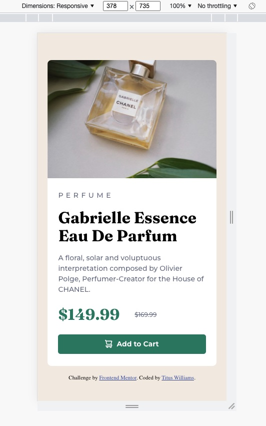

# Frontend Mentor - Product preview card component solution

This is a solution to the [Product preview card component challenge on Frontend Mentor](https://www.frontendmentor.io/challenges/product-preview-card-component-GO7UmttRfa). Frontend Mentor challenges help you improve your coding skills by building realistic projects. 

## Table of contents

- [Overview](#overview)
  - [The challenge](#the-challenge)
  - [Screenshot](#screenshot)
  - [Links](#links)
- [My process](#my-process)
  - [Built with](#built-with)
  - [What I learned](#what-i-learned)
  - [Continued development](#continued-development)
  - [Useful resources](#useful-resources)
- [Author](#author)


## Overview

### The challenge

Users should be able to:

- View the optimal layout depending on their device's screen size
- See hover and focus states for interactive elements

### Screenshot





### Links

- Solution URL: [challenge solution](https://www.frontendmentor.io/solutions/product-preview-card-component-BCN3-vimD0)
- Live Site URL: [My projects](https://stalwart-souffle-6e95e1.netlify.app)

## My process

### Built with

- CSS custom properties
- Flexbox
- Desktop-first workflow

### What I learned

This is the first project that I completed that included a mobile version. I started with the desktop layout first. Once completed I noticed that starting with the mobile version might be better for layouts such as this one. 

I felt much more comfortable using flexbox on this challenge compared to the last one. 

I learned more about accessibility and how to visually hide HTML elements to keep with the design of the page while still allowing screen readers to share information that is necessary for such individuals. 

This is the code I used to hide visually (I found this code from Scott O'Hara's blog "Inclusively Hidden"):

```html
<div class="prices">
  <span class="visually-hidden">current price</span>
  <span id="current-price">$149.99</span>
  <span class="visually-hidden">original price</span>
  <span id="original-price">$169.99</span>
</div>
```
```css
.visually-hidden:not(:focus):not(:active) {
  clip: rect(0 0 0 0); 
  clip-path: inset(50%);
  height: 1px;
  overflow: hidden;
  position: absolute;
  white-space: nowrap; 
  width: 1px;
}
```


### Continued development

I am going to continue working with manipulating images in flexbox. For some odd reason, this has been a bit of challenge for me at the start.

I would also like to study grid in csss and develope an understanding of when it is best to use in place of flexbox. 


### Useful resources

- [Scott O'Hara's blog](https://www.scottohara.me/blog/2017/04/14/inclusively-hidden.html) - This helped me for the visually hidden class. 


## Author

- Frontend Mentor - [@wtwilliams310](https://www.frontendmentor.io/profile/wtwilliams310)


